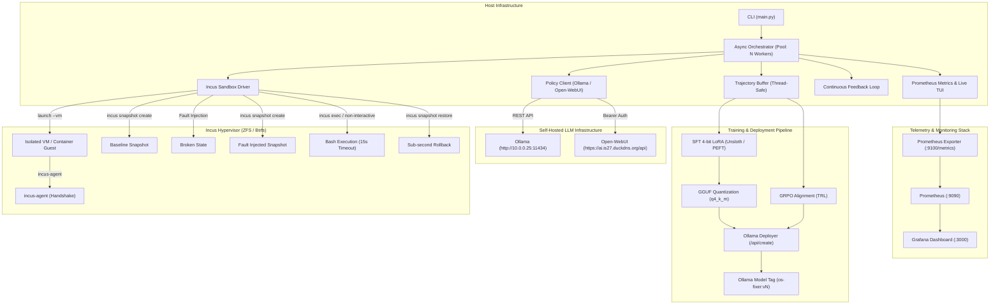

# OS-AutoFix Engine 🚀

[](https://github.com/Antigravity/os-autofix-engine/actions/workflows/ci.yml)
[](https://www.python.org/)
[](https://opensource.org/licenses/MIT)
[](https://linuxcontainers.org/incus/)

**os-autofix-engine** is an autonomous operating system-level policy training, evaluation, quantization, deployment, and closed-loop self-improvement harness designed for Large Language Model (LLM) Site Reliability Engineers.

It features **first-class support for Incus virtual machines and containers**, sub-second zero-copy COW snapshot rollbacks, structured JSON action enforcement, **4-bit LoRA (Unsloth / TRL)** and **GRPO alignment**, automatic **GGUF export**, remote **Ollama model deployment**, real-time **Prometheus telemetry & live TUI monitoring**, and continuous self-improving feedback loops.

---

## 🏛️ Architecture Overview



---

## 📋 Table of Contents
1. [Key Features](#-key-features)
2. [Prerequisites & Incus Setup](#-prerequisites--incus-setup)
3. [Endpoint Configuration](#-endpoint-configuration)
4. [Installation](#-installation)
5. [CLI Usage](#-cli-usage)
   - [Host Pre-Flight Doctor (`doctor`)](#1-host-pre-flight-doctor-doctor)
   - [Real-Time Monitoring & Telemetry (`monitor`)](#2-real-time-monitoring--telemetry-monitor)
   - [Environment Health Check (`test-env`)](#3-environment-health-check-test-env)
   - [Scenario Benchmarking (`bench`)](#4-scenario-benchmarking-bench)
   - [Dataset Collection (`collect`)](#5-dataset-collection-collect)
   - [SFT 4-bit LoRA Training (`train-sft`)](#6-sft-4-bit-lora-training-train-sft)
   - [GRPO Policy Optimization (`train-grpo`)](#7-grpo-policy-optimization-train-grpo)
   - [Model Packaging & Ollama Deployment (`deploy`)](#8-model-packaging--ollama-deployment-deploy)
   - [Continuous Self-Improvement Loop (`loop`)](#9-continuous-self-improvement-loop-loop)
   - [Production Systemd Daemon Deployment (`deploy-daemon`)](#10-production-systemd-daemon-deployment-deploy-daemon)
   - [Automated GitHub Repo Setup (`git-init`)](#11-automated-github-repo-setup-git-init)
6. [Supported Diagnostic Scenarios](#-supported-diagnostic-scenarios)
7. [Prometheus Metrics & Grafana](#-prometheus-metrics--grafana)
8. [Training Data Export Formats](#-training-data-export-formats)
9. [Testing & CI](#-testing--ci)

---

## ✨ Key Features

- **Native Incus Hypervisor Virtualization**: Ephemeral VM (`--vm`) or container isolation.
- **Zero-Copy Sub-Second Rollbacks**: Instant ZFS/Btrfs snapshotting before and after fault injection.
- **Guest Agent Polling**: Automatic `incus-agent` readiness detection with exponential backoff.
- **Context Protection**: Strict 2000-character stdout/stderr truncation and 15-second command timeouts.
- **Multi-Backend Inference**: Built-in integration with:
  - Local/Remote **Ollama** (`http://10.0.0.25:11434`)
  - **Open-WebUI** (`https://ai.is27.duckdns.org/api`) with Bearer token authentication.
  - OpenAI-compatible endpoints (`vLLM`, `LocalAI`, `DeepSeek`).
- **Real-Time Telemetry & Prometheus Exporter**: Native metrics exposition on `:9100/metrics` tracking sandboxes, tasks, steps, LLM latency, and snapshot revert performance.
- **Live Terminal UI (TUI) Dashboard**: Rich interactive dashboard tracking workers, agent thoughts, executed commands, and rolling pass rates in real-time.
- **4-bit LoRA Fine-Tuning**: `trainer/train_sft.py` targeting all linear attention/MLP layers (`q_proj`, `k_proj`, `v_proj`, `o_proj`, `gate_proj`, `up_proj`, `down_proj`) with GGUF export.
- **GRPO Alignment**: `trainer/train_grpo.py` using multi-component reward functions (terminal verification, step efficiency penalty, JSON schema compliance bonus).
- **Automated Ollama Deployer**: Dynamic Modelfile construction, REST streaming deployment (`/api/create`), and version tagging (`os-fixer:v1`, `os-fixer:v2`).
- **Continuous Closed-Loop Engine**: Full autonomous self-improvement loop: Benchmark $\to$ Collect $\to$ Filter $\to$ Train $\to$ Deploy $\to$ Verify with automatic regression rollback.

---

## ⚙️ Prerequisites & Incus Setup

### 1. Incus Hypervisor & Storage Pool
Ensure Incus is installed with a ZFS or Btrfs storage pool for zero-copy snapshots:

```bash
# Verify Incus daemon version
incus version

# Verify storage pools (ZFS recommended)
incus storage list

# Verify network bridges
incus network list
```

### 2. KVM Acceleration (for VM mode)
To run in VM mode (`--vm`), ensure hardware virtualization is accessible:
```bash
ls -l /dev/kvm
# Ensure your user is in the 'incus-admin' group
groups | grep incus-admin
```

---

## 🌐 Endpoint Configuration

The engine reads target endpoints from environment variables with production defaults:

| Variable | Default Value | Description |
|---|---|---|
| `OLLAMA_BASE_URL` | `http://10.0.0.25:11434/v1` | Ollama OpenAI-compatible or native `/api/chat` URL |
| `OPEN_WEBUI_BASE_URL` | `https://ai.is27.duckdns.org/api` | Open-WebUI REST API URL |
| `OPEN_WEBUI_API_KEY` | *(None)* | Bearer authentication token for Open-WebUI |
| `MODEL_NAME` | `qwen2.5-coder:7b` | Target LLM model name |
| `WORKER_COUNT` | `4` | Number of parallel Incus sandboxes |
| `TIMEOUT_SECONDS` | `15` | Default command execution timeout |
| `INCUS_PROJECT` | `default` | Incus project name |
| `INCUS_STORAGE_POOL` | `default` | Incus storage pool for snapshot copy-on-write |
| `INSTANCE_TYPE` | `vm` | `vm` for hardware isolation or `container` for lightweight speed |

---

## 📦 Installation

```bash
git clone https://github.com/Antigravity/os-autofix-engine.git
cd os-autofix-engine

# Create virtual environment
python3 -m venv .venv
source .venv/bin/activate

# Install dependencies
pip install -r requirements.txt
pip install -e .
```

---

## 💻 CLI Usage

The CLI is powered by `typer` and `rich`. Run `python3 main.py --help` for full documentation.

### 1. Host Pre-Flight Doctor (`doctor`)
Runs pre-flight diagnostics for KVM virtualization, Incus CLI/storage/bridges, and remote LLM endpoints:

```bash
python3 main.py doctor
```

### 2. Real-Time Monitoring & Telemetry (`monitor`)
Launch the live Rich terminal dashboard or start the standalone Prometheus metrics exporter:

```bash
# Launch interactive terminal TUI dashboard (with background metrics exporter)
python3 main.py monitor

# Run standalone HTTP Prometheus metrics server
python3 main.py monitor --port 9100 --server-only
```

### 3. Environment Health Check (`test-env`)
Validates Incus hypervisor, KVM acceleration, Ollama / Open-WebUI connectivity, and executes a live ephemeral sandbox snapshot rollback test:

```bash
python3 main.py test-env --type container
```

### 4. Scenario Benchmarking (`bench`)
Evaluates model performance across diagnostic fault scenarios in parallel:

```bash
python3 main.py bench \
  --backend ollama \
  --endpoint http://10.0.0.25:11434/v1 \
  --model qwen2.5-coder:7b \
  --workers 4 \
  --type vm
```

### 5. Dataset Collection (`collect`)
Generates exploration rollouts and exports positive trajectories for training:

```bash
python3 main.py collect \
  --scenarios all \
  --samples 20 \
  --workers 4 \
  --backend ollama \
  --format all \
  --output-dir data
```

### 6. SFT 4-bit LoRA Training (`train-sft`)
Fine-tunes base models on ShareGPT-formatted trajectory datasets with automatic GGUF quantization:

```bash
python3 main.py train-sft \
  --dataset data/dataset_unsloth_sharegpt.jsonl \
  --model qwen2.5-coder:7b \
  --output-dir outputs/sft_adapter \
  --epochs 3 \
  --batch-size 2 \
  --lora-r 16 \
  --export-gguf
```

### 7. GRPO Policy Optimization (`train-grpo`)
Runs Group Relative Policy Optimization using multi-component reward functions:

```bash
python3 main.py train-grpo \
  --dataset data/dataset_trl_grpo.jsonl \
  --model qwen2.5-coder:7b \
  --output-dir outputs/grpo_adapter \
  --epochs 1 \
  --generations 4
```

### 8. Model Packaging & Ollama Deployment (`deploy`)
Generates Modelfiles with structured system prompts and registers new model tags with Ollama:

```bash
python3 main.py deploy \
  --model-tag os-fixer:v1 \
  --base qwen2.5-coder:7b \
  --ollama-url http://10.0.0.25:11434
```

### 9. Continuous Self-Improvement Loop (`loop`)
Executes an autonomous closed-loop cycle (Benchmark $\to$ Collect $\to$ Filter $\to$ Train $\to$ Deploy $\to$ Verify) with automatic rollback protection:

```bash
python3 main.py loop \
  --iterations 3 \
  --samples 6 \
  --training-type sft \
  --model qwen2.5-coder:7b \
  --prefix os-fixer \
  --workers 4 \
  --type container \
  --ollama-url http://10.0.0.25:11434
```

### 10. Production Systemd Daemon Deployment (`deploy-daemon`)
Installs and enables the `os-autofix.service` and `os-autofix-metrics.service` unit files:

```bash
python3 main.py deploy-daemon --systemd-dir /etc/systemd/system --enable
```

### 11. Automated GitHub Repo Setup (`git-init`)
Initializes the git repository, stages all code, creates the remote repo, and pushes initial commits:

```bash
python3 main.py git-init --name os-autofix-engine --public
```

---

## 📈 Prometheus Metrics & Grafana

### Exported Prometheus Metrics

| Metric Name | Type | Description |
|---|---|---|
| `os_autofix_sandboxes_active` | Gauge | Active concurrent running Incus instances |
| `os_autofix_tasks_total` | Counter | Completed tasks partitioned by `scenario`, `model_tag`, `status` |
| `os_autofix_episode_steps` | Histogram | Steps per scenario resolution |
| `os_autofix_llm_latency_seconds` | Histogram | LLM inference latency per model request |
| `os_autofix_sandbox_revert_seconds` | Histogram | ZFS/Btrfs CoW snapshot restore latency |
| `os_autofix_model_pass_rate` | Gauge | Current benchmark generation pass rate accuracy |

### Launching Prometheus & Grafana Stack

```bash
cd deploy/
docker compose up -d
```

- Prometheus UI: `http://localhost:9090`
- Grafana UI: `http://localhost:3000` (Pre-loaded dashboard in [`monitoring/grafana_dashboard.json`](file:///Docs/Programming/GitHub/os-autofix-engine/monitoring/grafana_dashboard.json))

---

## 🎯 Supported Diagnostic Scenarios

| Scenario | Category | Difficulty | Max Steps | Description |
|---|---|---|---|---|
| [`systemd_dns`](file:///Docs/Programming/GitHub/os-autofix-engine/scenarios/systemd_dns.py) | Networking / DNS | Medium | 8 | Domain name resolution failure caused by broken systemd-resolved and symlinks. |
| [`network_routing`](file:///Docs/Programming/GitHub/os-autofix-engine/scenarios/network_routing.py) | Networking / Routing | Medium | 8 | Corrupted default gateway route breaking outbound IP packet routing. |
| [`package_corruption`](file:///Docs/Programming/GitHub/os-autofix-engine/scenarios/package_corruption.py) | Package Management | Easy | 6 | Locked or interrupted APT/dpkg state preventing package operations. |
| [`file_permissions`](file:///Docs/Programming/GitHub/os-autofix-engine/scenarios/file_permissions.py) | Security / Permissions | Easy | 6 | Critical system configuration files (`/etc/sudoers`, `/etc/ssh/sshd_config`) with corrupted permissions. |
| [`zfs_mount`](file:///Docs/Programming/GitHub/os-autofix-engine/scenarios/zfs_mount.py) | Storage / Filesystems | Medium | 8 | Unmounted or inaccessible filesystem dataset mountpoints (`/mnt/data`). |
| [`docker_socket`](file:///Docs/Programming/GitHub/os-autofix-engine/scenarios/docker_socket.py) | Containers / Docker | Medium | 6 | Permission lockouts and service failures on `/var/run/docker.sock`. |
| [`iptables_lockout`](file:///Docs/Programming/GitHub/os-autofix-engine/scenarios/iptables_lockout.py) | Networking / Security | Medium | 8 | Restrictive outbound firewall DROP rules blocking DNS and HTTP/HTTPS traffic. |

---

## 🔔 Webhook Alerts & Notification Dispatcher

The [`WebhookAlertDispatcher`](file:///Docs/Programming/GitHub/os-autofix-engine/monitoring/alerts.py) supports Discord, Slack, and generic JSON webhook endpoints:

- **Environment Variable**: `WEBHOOK_ALERT_URL="https://discord.com/api/webhooks/..."`
- **Real-Time Notification Triggers**:
  - `model_promoted`: Fired when a newly trained model generation beats baseline thresholds and is promoted.
  - `model_regression`: Fired when an evaluated model generation regresses below threshold, detailing automatic rollback.
  - `worker_failure`: Fired on Incus guest agent handshake timeouts or sandbox execution crashes.

---

## 📊 Training Data Export Formats

The [`TrajectoryBuffer`](file:///Docs/Programming/GitHub/os-autofix-engine/trainer/trajectory_buffer.py#L51) exports:

1. **Hugging Face TRL GRPO** (`data/dataset_trl_grpo.jsonl`):
   ```json
   {
     "prompt": "Diagnose and resolve the following OS issue: systemd_dns",
     "completion": "{\"thought\": \"Restarting resolver\", \"command\": \"systemctl restart systemd-resolved\", \"is_done\": true}",
     "reward": 1.15,
     "success": true,
     "scenario": "systemd_dns",
     "steps_count": 1
   }
   ```

2. **Hugging Face TRL DPO** (`data/dataset_trl_dpo.jsonl`):
   ```json
   {
     "prompt": "Diagnose and resolve the following OS issue: systemd_dns",
     "chosen": "{\"thought\": \"Fix symlink\", \"command\": \"ln -sf ... /etc/resolv.conf\", \"is_done\": true}",
     "rejected": "{\"thought\": \"Unknown\", \"command\": \"reboot\", \"is_done\": true}",
     "scenario": "systemd_dns"
   }
   ```

3. **Unsloth / ShareGPT** (`data/dataset_unsloth_sharegpt.jsonl`):
   ```json
   {
     "id": "episode-uuid",
     "conversations": [
       {"from": "human", "value": "Troubleshoot and resolve this OS issue:\nScenario: systemd_dns"},
       {"from": "gpt", "value": "{\"thought\": \"Fix DNS\", \"command\": \"systemctl restart systemd-resolved\", \"is_done\": true}"}
     ]
   }
   ```

---

## 🧪 Testing & CI

```bash
# Run linter and formatter checks
ruff check . && ruff format --check .

# Run static type checking
mypy config sandbox engine scenarios trainer monitoring deploy tests

# Run all 45 unit and integration tests
pytest -v tests/
```

GitHub Actions workflow ([`.github/workflows/ci.yml`](file:///Docs/Programming/GitHub/os-autofix-engine/.github/workflows/ci.yml)) automatically runs the test matrix across Python 3.10, 3.11, 3.12, and 3.13 on every pull request.
