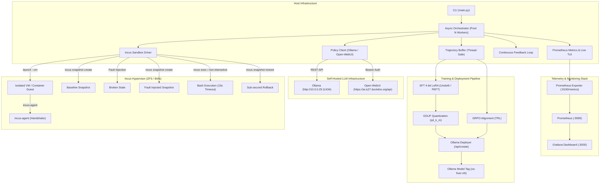

# OS-AutoFix Engine 🚀

[](https://github.com/Antigravity/os-autofix-engine/actions/workflows/ci.yml)
[](https://www.python.org/)
[](https://opensource.org/licenses/MIT)
[](https://linuxcontainers.org/incus/)

**os-autofix-engine** is an autonomous operating system-level policy training, evaluation, quantization, deployment, and closed-loop self-improvement harness designed for Large Language Model (LLM) Site Reliability Engineers.

It features **first-class support for Incus virtual machines and containers**, sub-second zero-copy COW snapshot rollbacks, structured JSON action enforcement, **4-bit LoRA (Unsloth / TRL)** and **GRPO alignment**, automatic **GGUF export**, remote **Ollama model deployment**, real-time **Prometheus telemetry & live TUI monitoring**, and continuous self-improving feedback loops.

---

## 🏛️ Architecture Overview



---

## 📋 Table of Contents
1. [Key Features](#-key-features)
2. [Prerequisites & Incus Setup](#-prerequisites--incus-setup)
3. [Endpoint Configuration](#-endpoint-configuration)
4. [Installation](#-installation)
5. [CLI Usage](#-cli-usage)
   - [SMT Formal Verification Theorem Prover (`formal-verify`)](#1-smt-formal-verification-theorem-prover-formal-verify)
   - [Edge Model Distillation & Packaging (`distill`)](#2-edge-model-distillation--packaging-distill)
   - [Production System Packaging & Artifact Builder (`build-dist`)](#3-production-system-packaging--artifact-builder-build-dist)
   - [Differential State Shadow Engine (`shadow-exec`)](#4-differential-state-shadow-engine-shadow-exec)
   - [CRIU Process State Preserver & Hotpatcher (`checkpoint-proc`)](#5-criu-process-state-preserver--hotpatcher-checkpoint-proc)
   - [Progressive Canary Fleet Rollout Manager (`fleet-rollout`)](#6-progressive-canary-fleet-rollout-manager-fleet-rollout)
   - [Causal Fault Graph & Root-Cause Tracer (`trace-causal`)](#7-causal-fault-graph--root-cause-tracer-trace-causal)
   - [Mandatory Access Control Profile Synthesizer (`synthesize-mac`)](#8-mandatory-access-control-profile-synthesizer-synthesize-mac)
   - [Combinatorial Cascading Fault Fuzzer (`fuzz-cascading`)](#9-combinatorial-cascading-fault-fuzzer-fuzz-cascading)
   - [Federated Cluster Node (`cluster-node`)](#10-federated-cluster-node-cluster-node)
   - [Dynamic eBPF Network Chaos (`net-chaos`)](#11-dynamic-ebpf-network-chaos-net-chaos)
   - [Cluster Consensus Status (`cluster-status`)](#12-cluster-consensus-status-cluster-status)
   - [Documentation & Runbook Indexer (`index-docs`)](#13-documentation--runbook-indexer-index-docs)
   - [Knowledge Base Query (`query-knowledge`)](#14-knowledge-base-query-query-knowledge)
   - [Host Self-Healing Watchdog Daemon (`watchdog`)](#15-host-self-healing-watchdog-daemon-watchdog)
   - [Kernel Syscall Security Auditor (`audit-security`)](#16-kernel-syscall-security-auditor-audit-security)
   - [Autonomous Chaos Engineering Daemon (`chaos`)](#17-autonomous-chaos-engineering-daemon-chaos)
   - [Multi-Node Distributed Topology Benchmark (`bench-distributed`)](#18-multi-node-distributed-topology-benchmark-bench-distributed)
   - [Model Context Protocol (MCP) Server (`mcp`)](#19-model-context-protocol-mcp-server-mcp)
   - [Tri-Agent Specialist Swarm (`swarm`)](#20-tri-agent-specialist-swarm-swarm)
   - [Model Arena ELO Tournament (`arena`)](#21-model-arena-elo-tournament-arena)
   - [Open-WebUI Pipeline Bundle Export (`export-webui`)](#22-open-webui-pipeline-bundle-export-export-webui)
   - [Monte Carlo Tree Search Trajectory Collection (`mcts-collect`)](#23-monte-carlo-tree-search-trajectory-collection-mcts-collect)
   - [Synthetic Scenario Synthesizer (`synthesize-scenario`)](#24-synthetic-scenario-synthesizer-synthesize-scenario)
   - [Host Pre-Flight Doctor (`doctor`)](#25-host-pre-flight-doctor-doctor)
   - [Real-Time Monitoring & Telemetry (`monitor`)](#26-real-time-monitoring--telemetry-monitor)
   - [Environment Health Check (`test-env`)](#27-environment-health-check-test-env)
   - [Scenario Benchmarking (`bench`)](#28-scenario-benchmarking-bench)
   - [Dataset Collection (`collect`)](#29-dataset-collection-collect)
   - [SFT 4-bit LoRA Training (`train-sft`)](#30-sft-4-bit-lora-training-train-sft)
   - [GRPO Policy Optimization (`train-grpo`)](#31-grpo-policy-optimization-train-grpo)
   - [Model Packaging & Ollama Deployment (`deploy`)](#32-model-packaging--ollama-deployment-deploy)
   - [Continuous Self-Improvement Loop (`loop`)](#33-continuous-self-improvement-loop-loop)
   - [Production Systemd Daemon Deployment (`deploy-daemon`)](#34-production-systemd-daemon-deployment-deploy-daemon)
   - [Automated GitHub Repo Setup (`git-init`)](#35-automated-github-repo-setup-git-init)
6. [SMT Formal Verification & Policy Theorem Prover](#-smt-formal-verification--policy-theorem-prover)
7. [Edge Model Distillation & Artifact Packaging](#-edge-model-distillation--artifact-packaging)
8. [Distributed OpenTelemetry (OTel) Tracing](#-distributed-opentelemetry-otel-tracing)
9. [Production System Packaging & Artifact Builder](#-production-system-packaging--artifact-builder)
10. [Self-Supervised Differential State Shadow Engine](#-self-supervised-differential-state-shadow-engine)
11. [CRIU Process State Preserver & Live Hotpatcher](#-criu-process-state-preserver--live-hotpatcher)
12. [Progressive Canary Fleet Rollout Manager](#-progressive-canary-fleet-rollout-manager)
13. [Causal Fault Graph & Root-Cause Tracer](#-causal-fault-graph--root-cause-tracer)
14. [Mandatory Access Control (MAC) Synthesizer](#-mandatory-access-control-mac-synthesizer)
15. [Combinatorial Cascading Fault Fuzzer](#-combinatorial-cascading-fault-fuzzer)
16. [Distributed Raft Consensus & Cluster Lock Manager](#-distributed-raft-consensus--cluster-lock-manager)
17. [Dynamic eBPF / Traffic Control Network Chaos](#-dynamic-ebpf--traffic-control-network-chaos)
18. [Cross-Host Distributed Remediation Engine](#-cross-host-distributed-remediation-engine)
19. [Offline Hybrid Documentation & Runbook Retriever](#-offline-hybrid-documentation--runbook-retriever)
20. [Human-in-the-Loop Interactive Webhook Approval Gate](#-human-in-the-loop-interactive-webhook-approval-gate)
21. [Host Self-Healing Watchdog Daemon](#-host-self-healing-watchdog-daemon)
22. [Kernel Syscall Security Auditor & eBPF Inspection](#-kernel-syscall-security-auditor--ebpf-inspection)
23. [Multi-Node Distributed Scenarios](#-multi-node-distributed-scenarios)
24. [Autonomous Chaos Engineering Daemon](#-autonomous-chaos-engineering-daemon)
25. [Model Context Protocol (MCP) Integration](#-model-context-protocol-mcp-integration)
26. [Open-WebUI Pipeline & Tools](#-open-webui-pipeline--tools)
27. [Model Arena & ELO Rating System](#-model-arena--elo-rating-system)
28. [Supported Diagnostic Scenarios](#-supported-diagnostic-scenarios)
29. [Prometheus Metrics & Grafana](#-prometheus-metrics--grafana)
30. [Training Data Export Formats](#-training-data-export-formats)
31. [Testing & CI](#-testing--ci)

---

## ✨ Key Features

- **SMT Formal Verification & Z3 Theorem Proving**: Automated theorem prover mathematically validating network routing tables, firewall lattices, and file permission boundaries prior to sandbox application.
- **Edge Model Distillation Pipeline**: Compresses 7B/14B teacher models into sub-1B edge policies (e.g., Qwen2.5-0.5B-Coder) with automated ONNX Runtime and 4-bit GGUF quantization.
- **Distributed OpenTelemetry (OTel) Tracing**: End-to-end distributed span tracking across all engine lifecycles with OTLP standard export formats for Jaeger and Tempo.
- **Enterprise System Packaging**: Compiles standalone binaries and generates native Debian (`.deb`) and RPM (`.rpm`) packages with systemd units and manpages.
- **Self-Supervised Differential State Shadow Engine**: Twin sandbox differential execution (Primary vs Shadow control) calculating file hash diffs, socket availability, and memory deltas to assert zero regression prior to fleet promotion.
- **CRIU Process State Preserver & Live Hotpatcher**: Checkpoint and restore running daemons (`criu dump` / `criu restore --tcp-established`) without dropping active TCP connections with automated fallback rollback.
- **Progressive Canary Fleet Rollout Manager**: Multi-tier rollout orchestration ($10\% \to 50\% \to 100\%$) across $N$-instance fleets with real-time error rate tracking and atomic auto-rollback if errors exceed $2.0\%$.
- **Causal Fault Graph & Root-Cause Tracer**: Directed acyclic graph (DAG) builder correlating systemd unit dependencies, open network sockets, and file states to distinguish root triggers from downstream symptoms with Bayesian confidence scoring.
- **Automated Mandatory Access Control (MAC) Synthesizer**: AppArmor profile and SELinux Type Enforcement (`.te`) generator producing least-privilege policies from runtime daemon traces without breaking containment.
- **Combinatorial Cascading Fault Fuzzer**: Multi-domain compound outage generator evaluating swarm remediation against simultaneous network, storage, permissions, and security breakages.
- **Distributed Raft Consensus & Lock Manager**: Lightweight asynchronous Raft consensus for multi-host watchdog orchestrators with term management, leader election, and distributed locking.
- **Dynamic eBPF / TC Network Fault Injection**: Kernel-level TC netem & eBPF traffic shaping on veth/bridge interfaces injecting latency, jitter, packet drop rates, and asymmetrical partition drops with guaranteed teardown.
- **Cross-Host Distributed Remediation Engine**: Multi-node cluster remediation coordinating split-brain recovery (etcd Raft, Keepalived HA, WireGuard mesh) with synchronized snapshots and atomic multi-host rollbacks.
- **Offline Hybrid Documentation & Runbook Retriever**: Embedded BM25 + vector search engine parsing Linux manpages and markdown runbooks for systemd, ZFS, networking, Docker, and PAM authentication.
- **Human-in-the-Loop Interactive Webhook Approval Gate**: Intercepts high-blast-radius actions (safety score 0.70 - 0.85) with actionable Discord/Slack notifications and callback approvals.
- **Host Self-Healing Watchdog Daemon**: Continuously analyzes `journalctl` log streams, detects anomalies, and validates remediation inside ephemeral Incus shadow containers before live application.
- **Kernel-Level Syscall Security Auditor**: Intercepts `execve`, `unlinkat`, `chmod`, `connect`, `init_module` to catch recursive wiping (`rm -rf /`), reverse shells, and credential theft with automatic rollback if safety score drops below 0.70.
- **Multi-Node Distributed Topology Scenarios**: Orchestrates multi-instance Incus overlay topologies (`wireguard_mesh`, `etcd_split_brain`, `reverse_proxy_ha`) with automated cross-node fault injection and raft quorum verifiers.
- **Autonomous Chaos Engineering Daemon**: Continuously injects Poisson-distributed faults across a fleet of canary sandboxes, measuring Mean Time to Resolution (MTTR) and safety score distributions in real-time.
- **Tri-Agent Specialist Swarm (`Triage` $\to$ `Remediation` $\to$ `Audit`)**: Structured multi-turn state machine handoffs with read-only inspection boundaries, surgical state mutation, and automatic rollback on collateral damage.
- **Model Arena ELO Rating System**: Paired A/B tournament testing between model checkpoints on identical cloned snapshots with standard ELO update calculations ($K=32$) and multi-tier victory scoring.
- **Interactive Open-WebUI Pipeline & Tool Integration**: Real-time streaming pipeline filter yielding thoughts, bash commands, and diagnostics directly into `https://ai.is27.duckdns.org`.
- **Monte Carlo Tree Search (MCTS) Trajectory Collector**: Explores OS action spaces with snapshot branching, UCT selection, loop pruning heuristics, and shortest-path extraction into `data/dataset_mcts_optimal.jsonl`.
- **LLM-Driven Synthetic Scenario Synthesizer**: Prompts teacher models to generate novel Linux failure scenarios, dynamically compiles Python code, validates in 3-phase sandbox pre-flight checks, and registers them automatically.
- **Model Context Protocol (MCP) Server**: Exposes sandbox creation, fault injection, command execution, and benchmark metrics over stdio / SSE to Claude Desktop, Open-WebUI, and AI agent frameworks.
- **Native Incus Hypervisor Virtualization**: Ephemeral VM (`--vm`) or container isolation.
- **Zero-Copy Sub-Second Rollbacks**: Instant ZFS/Btrfs snapshotting before and after fault injection.
- **Guest Agent Polling**: Automatic `incus-agent` readiness detection with exponential backoff.
- **Context Protection**: Strict 2000-character stdout/stderr truncation and 15-second command timeouts.
- **Multi-Backend Inference**: Built-in integration with:
  - Local/Remote **Ollama** (`http://10.0.0.25:11434`)
  - **Open-WebUI** (`https://ai.is27.duckdns.org/api`) with Bearer token authentication.
  - OpenAI-compatible endpoints (`vLLM`, `LocalAI`, `DeepSeek`).
- **Real-Time Telemetry & Prometheus Exporter**: Native metrics exposition on `:9100/metrics` tracking sandboxes, tasks, steps, LLM latency, and snapshot revert performance.
- **Live Terminal UI (TUI) Dashboard**: Rich interactive dashboard tracking workers, agent thoughts, executed commands, and rolling pass rates in real-time.
- **4-bit LoRA Fine-Tuning**: `trainer/train_sft.py` targeting all linear attention/MLP layers (`q_proj`, `k_proj`, `v_proj`, `o_proj`, `gate_proj`, `up_proj`, `down_proj`) with GGUF export.
- **GRPO Alignment**: `trainer/train_grpo.py` using multi-component reward functions (terminal verification, step efficiency penalty, JSON schema compliance bonus).
- **Automated Ollama Deployer**: Dynamic Modelfile construction, REST streaming deployment (`/api/create`), and version tagging (`os-fixer:v1`, `os-fixer:v2`).
- **Continuous Closed-Loop Engine**: Full autonomous self-improvement loop: Benchmark $\to$ Collect $\to$ Filter $\to$ Train $\to$ Deploy $\to$ Verify with automatic regression rollback.

---

## ⚙️ Prerequisites & Incus Setup

### 1. Incus Hypervisor & Storage Pool
Ensure Incus is installed with a ZFS or Btrfs storage pool for zero-copy snapshots:

```bash
# Verify Incus daemon version
incus version

# Verify storage pools (ZFS recommended)
incus storage list

# Verify network bridges
incus network list
```

### 2. KVM Acceleration (for VM mode)
To run in VM mode (`--vm`), ensure hardware virtualization is accessible:
```bash
ls -l /dev/kvm
# Ensure your user is in the 'incus-admin' group
groups | grep incus-admin
```

---

## 🌐 Endpoint Configuration

The engine reads target endpoints from environment variables with production defaults:

| Variable | Default Value | Description |
|---|---|---|
| `OLLAMA_BASE_URL` | `http://10.0.0.25:11434/v1` | Ollama OpenAI-compatible or native `/api/chat` URL |
| `OPEN_WEBUI_BASE_URL` | `https://ai.is27.duckdns.org/api` | Open-WebUI REST API URL |
| `OPEN_WEBUI_API_KEY` | *(None)* | Bearer authentication token for Open-WebUI |
| `MODEL_NAME` | `qwen2.5-coder:7b` | Target LLM model name |
| `WORKER_COUNT` | `4` | Number of parallel Incus sandboxes |
| `TIMEOUT_SECONDS` | `15` | Default command execution timeout |
| `INCUS_PROJECT` | `default` | Incus project name |
| `INCUS_STORAGE_POOL` | `default` | Incus storage pool for snapshot copy-on-write |
| `INSTANCE_TYPE` | `vm` | `vm` for hardware isolation or `container` for lightweight speed |

---

## 📦 Installation

```bash
git clone https://github.com/Antigravity/os-autofix-engine.git
cd os-autofix-engine

# Create virtual environment
python3 -m venv .venv
source .venv/bin/activate

# Install dependencies
pip install -r requirements.txt
pip install -e .
```

---

## 💻 CLI Usage

### 1. SMT Formal Verification Theorem Prover (`formal-verify`)
Mathematically proves absence of routing loops, shadowed firewall rules, and POSIX ACL privilege escalation vectors:

```bash
# Run multi-domain formal verification proof
python3 main.py formal-verify --domain combined

# Verify specific routing table JSON for acyclicity
python3 main.py formal-verify --domain network --routes-json routes.json --output reports/smt_proof.json
```

### 2. Edge Model Distillation & Packaging (`distill`)
Distills large 7B/14B teacher policies into sub-1B edge policies and exports ONNX Runtime and 4-bit GGUF binaries:

```bash
python3 main.py distill \
  --teacher qwen2.5-coder:7b \
  --student qwen2.5-coder:0.5b \
  --temperature 2.0 \
  --output-dir outputs/distilled \
  --quant q4_k_m
```

### 3. Production System Packaging & Artifact Builder (`build-dist`)
Builds standalone binaries, Debian (`.deb`) and RPM (`.rpm`) system packages, and Unix manpages:

```bash
python3 main.py build-dist --output-dir dist --deb --rpm --binary
```

### 4. Differential State Shadow Engine (`shadow-exec`)
Executes twin sandboxes (Primary vs Shadow control) to evaluate state diffs and assert zero regression before fleet promotion:

```bash
# Run differential state evaluation comparing fixed Primary vs broken Shadow
python3 main.py shadow-exec --scenario systemd_dns --primary canary-primary --shadow canary-shadow

# Export Mermaid topology diff graph and JSON report
python3 main.py shadow-exec --scenario systemd_dns --mermaid --output reports/shadow_diff.json
```

### 5. CRIU Process State Preserver & Hotpatcher (`checkpoint-proc`)
Checkpoints running daemon processes, memory mappings, and open TCP sockets before applying patches, then restores without connection drops:

```bash
python3 main.py checkpoint-proc \
  --instance canary-criu-1 \
  --daemon systemd-resolved \
  --patch-cmd "echo 'DNS=1.1.1.1' >> /etc/systemd/resolved.conf" \
  --rollback-cmd "sed -i '/DNS=1.1.1.1/d' /etc/systemd/resolved.conf" \
  --tcp
```

### 6. Progressive Canary Fleet Rollout Manager (`fleet-rollout`)
Orchestrates multi-tier canary progression ($10\% \to 50\% \to 100\%$) with real-time error rate tracking and automated atomic rollback:

```bash
python3 main.py fleet-rollout \
  --scenario systemd_dns \
  --fleet-size 10 \
  --error-threshold 0.02 \
  --output reports/fleet_rollout_latest.json
```

### 7. Causal Fault Graph & Root-Cause Tracer (`trace-causal`)
Inspects sandbox dependencies, socket states, and service logs to render a causal DAG with Bayesian-weighted root-cause hypotheses:

```bash
# Render interactive ASCII table of ranked root triggers
python3 main.py trace-causal --instance canary-trace-1

# Render Mermaid graph definition and export structured JSON summary
python3 main.py trace-causal --instance canary-trace-1 --mermaid --output reports/causal_graph.json
```

### 8. Mandatory Access Control Profile Synthesizer (`synthesize-mac`)
Passively profiles daemon executions and generates least-privilege AppArmor / SELinux policy profiles:

```bash
python3 main.py synthesize-mac \
  --binary /usr/sbin/nginx \
  --profile-name nginx \
  --output /etc/apparmor.d/usr.sbin.nginx
```

### 9. Combinatorial Cascading Fault Fuzzer (`fuzz-cascading`)
Executes simultaneous multi-domain compound fault injections to test swarm recovery under coupled multi-point outages:

```bash
python3 main.py fuzz-cascading \
  --domains network,storage,permissions,security \
  --instance canary-fuzz-1
```

### 10. Federated Cluster Node (`cluster-node`)
Starts an autonomous federated cluster node running Raft leader election and distributed lock management:

```bash
# Start primary node
python3 main.py cluster-node --node-id node-1 --peers node-2,node-3 --raft-port 9200

# Start follower peer
python3 main.py cluster-node --node-id node-2 --peers node-1,node-3 --raft-port 9201
```

### 11. Dynamic eBPF Network Chaos (`net-chaos`)
Injects dynamic kernel-level TC netem & eBPF traffic shaping rules into an active Incus container/VM:

```bash
python3 main.py net-chaos \
  --instance canary-net-1 \
  --interface eth0 \
  --latency-ms 100.0 \
  --jitter-ms 10.0 \
  --drop-rate 0.15 \
  --duration-sec 10.0
```

### 12. Cluster Consensus Status (`cluster-status`)
Displays active cluster consensus roles, term generation, elected leader, and active distributed resource locks:

```bash
python3 main.py cluster-status
```

### 13. Documentation & Runbook Indexer (`index-docs`)
Indexes offline Linux troubleshooting runbooks and manpage documentation into the hybrid search engine:

```bash
python3 main.py index-docs --runbooks-dir knowledge/runbooks --output reports/knowledge_index.json
```

### 14. Knowledge Base Query (`query-knowledge`)
Queries the offline hybrid BM25 / vector knowledge base for diagnostic runbooks:

```bash
python3 main.py query-knowledge --query "DNS resolution failure in systemd" --top-k 3
```

### 15. Host Self-Healing Watchdog Daemon (`watchdog`)
Runs the proactive journal stream watchdog with shadow container dry-run verification:

```bash
# Run in safe dry-run mode (validates fixes in Incus without modifying host)
python3 main.py watchdog --dry-run --min-safety-score 0.85

# Run in live mode (applies validated fixes to host)
python3 main.py watchdog --live --min-safety-score 0.90
```

### 16. Kernel Syscall Security Auditor (`audit-security`)
Inspects arbitrary commands or remediation scripts for destructive anti-patterns, reverse shells, and credential theft:

```bash
# Audit a high-risk destructive command
python3 main.py audit-security --command "rm -rf /"

# Audit a safe remediation command
python3 main.py audit-security --command "systemctl restart systemd-resolved"
```

### 17. Autonomous Chaos Engineering Daemon (`chaos`)
Runs continuous randomized Poisson-distributed fault injection experiments across a fleet of canary sandboxes:

```bash
python3 main.py chaos \
  --rate-minutes 1.0 \
  --fleet-size 3 \
  --duration-hours 1.0 \
  --type container
```

### 18. Multi-Node Distributed Topology Benchmark (`bench-distributed`)
Runs multi-node cluster verifications across WireGuard mesh, etcd Raft consensus, and Keepalived HA reverse proxies:

```bash
python3 main.py bench-distributed --scenario all --type container
```

### 19. Model Context Protocol (MCP) Server (`mcp`)
Starts the MCP server over standard I/O (stdio) or Server-Sent Events (SSE) for Claude Desktop, Open-WebUI, or external AI agents:

```bash
# Run MCP server on stdio (for Claude Desktop / IDE agents)
python3 main.py mcp

# Run MCP server on SSE (for remote network agents)
python3 main.py mcp --transport sse --port 8080
```

### 20. Tri-Agent Specialist Swarm (`swarm`)
Executes coordinated multi-turn handoffs between read-only Triage, surgical Remediation, and collateral safety Audit agents:

```bash
python3 main.py swarm \
  --scenario systemd_dns \
  --max-cycles 2 \
  --type container \
  --model qwen2.5-coder:7b
```

### 21. Model Arena ELO Tournament (`arena`)
Runs head-to-head A/B tournament matches between baseline and challenger models across identical sandbox snapshots with persistent ELO tracking:

```bash
python3 main.py arena \
  --model-a qwen2.5-coder:7b \
  --model-b os-fixer:v1 \
  --scenarios all \
  --rounds 2 \
  --ratings-file reports/arena_ratings.json
```

### 22. Open-WebUI Pipeline Bundle Export (`export-webui`)
Exports the ready-to-import Open-WebUI pipeline code and tool function calling schema:

```bash
python3 main.py export-webui --output dist/open_webui_bundle.json
```

### 23. Monte Carlo Tree Search Trajectory Collection (`mcts-collect`)
Explores the OS action space using snapshot-branching Monte Carlo Tree Search and extracts the optimal shortest-path resolution trajectory:

```bash
python3 main.py mcts-collect \
  --scenario systemd_dns \
  --simulations 15 \
  --exploration-constant 1.414 \
  --max-depth 6 \
  --branch-factor 3 \
  --output-file data/dataset_mcts_optimal.jsonl \
  --backend ollama \
  --model qwen2.5-coder:7b
```

### 24. Synthetic Scenario Synthesizer (`synthesize-scenario`)
Uses teacher LLMs to synthesize novel Linux diagnostic scenarios, validates them inside Incus sandboxes across 3 verification phases, and automatically registers them:

```bash
python3 main.py synthesize-scenario \
  --count 3 \
  --topic "PAM security lockout and file descriptor limits" \
  --output-dir scenarios/synthetic \
  --validate \
  --backend ollama \
  --model qwen2.5-coder:7b
```

### 25. Host Pre-Flight Doctor (`doctor`)
Runs pre-flight diagnostics for KVM virtualization, Incus CLI/storage/bridges, and remote LLM endpoints:

```bash
python3 main.py doctor
```

### 26. Real-Time Monitoring & Telemetry (`monitor`)
Launch the live Rich terminal dashboard or start the standalone Prometheus metrics exporter:

```bash
# Launch interactive terminal TUI dashboard (with background metrics exporter)
python3 main.py monitor

# Run standalone HTTP Prometheus metrics server
python3 main.py monitor --port 9100 --server-only
```

### 27. Environment Health Check (`test-env`)
Validates Incus hypervisor, KVM acceleration, Ollama / Open-WebUI connectivity, and executes a live ephemeral sandbox snapshot rollback test:

```bash
python3 main.py test-env --type container
```

### 28. Scenario Benchmarking (`bench`)
Evaluates model performance across diagnostic fault scenarios in parallel:

```bash
python3 main.py bench \
  --backend ollama \
  --endpoint http://10.0.0.25:11434/v1 \
  --model qwen2.5-coder:7b \
  --workers 4 \
  --type vm
```

### 29. Dataset Collection (`collect`)
Generates exploration rollouts and exports positive trajectories for training:

```bash
python3 main.py collect \
  --scenarios all \
  --samples 20 \
  --workers 4 \
  --backend ollama \
  --format all \
  --output-dir data
```

### 30. SFT 4-bit LoRA Training (`train-sft`)
Fine-tunes base models on ShareGPT-formatted trajectory datasets with automatic GGUF quantization:

```bash
python3 main.py train-sft \
  --dataset data/dataset_unsloth_sharegpt.jsonl \
  --model qwen2.5-coder:7b \
  --output-dir outputs/sft_adapter \
  --epochs 3 \
  --batch-size 2 \
  --lora-r 16 \
  --export-gguf
```

### 31. GRPO Policy Optimization (`train-grpo`)
Runs Group Relative Policy Optimization using multi-component reward functions:

```bash
python3 main.py train-grpo \
  --dataset data/dataset_trl_grpo.jsonl \
  --model qwen2.5-coder:7b \
  --output-dir outputs/grpo_adapter \
  --epochs 1 \
  --generations 4
```

### 32. Model Packaging & Ollama Deployment (`deploy`)
Generates Modelfiles with structured system prompts and registers new model tags with Ollama:

```bash
python3 main.py deploy \
  --model-tag os-fixer:v1 \
  --base qwen2.5-coder:7b \
  --ollama-url http://10.0.0.25:11434
```

### 33. Continuous Self-Improvement Loop (`loop`)
Executes an autonomous closed-loop cycle (Benchmark $\to$ Collect $\to$ Filter $\to$ Train $\to$ Deploy $\to$ Verify) with automatic rollback protection:

```bash
python3 main.py loop \
  --iterations 3 \
  --samples 6 \
  --training-type sft \
  --model qwen2.5-coder:7b \
  --prefix os-fixer \
  --workers 4 \
  --type container \
  --ollama-url http://10.0.0.25:11434
```

### 34. Production Systemd Daemon Deployment (`deploy-daemon`)
Installs and enables the `os-autofix.service` and `os-autofix-metrics.service` unit files:

```bash
python3 main.py deploy-daemon --systemd-dir /etc/systemd/system --enable
```

### 35. Automated GitHub Repo Setup (`git-init`)
Initializes the git repository, stages all code, creates the remote repo, and pushes initial commits:

```bash
python3 main.py git-init --name os-autofix-engine --public
```

---

## 📐 SMT Formal Verification & Policy Theorem Prover

The **Formal Verifier** ([`security/formal_verifier.py`](file:///Docs/Programming/GitHub/os-autofix-engine/security/formal_verifier.py)) applies First-Order Logic and Z3 SMT constraints:

- **Routing Graph Acyclicity**: Formally proves absence of cyclic routing loops and unreachable blackholes.
- **Firewall Rule Precedence Lattices**: Proves that no critical ACCEPT rules (SSH, DNS, Metrics) are shadowed behind global DROPs.
- **POSIX ACL Security Bounds**: Refutes mutations that violate least-privilege mode lattices on critical paths (`/etc/sudoers`, `/etc/shadow`, `/root/.ssh/id_rsa`).

---

## ⚡ Edge Model Distillation & Artifact Packaging

The **Distillation Pipeline** ([`trainer/distillation_pipeline.py`](file:///Docs/Programming/GitHub/os-autofix-engine/trainer/distillation_pipeline.py)):

- **Soft Token Distillation**: Combines hard Cross-Entropy and soft KL-divergence loss over teacher distributions.
- **Compact Artifacts**: Exports directly to ONNX Runtime and quantized 4-bit GGUF (`q4_k_m`) artifacts for sub-500MB edge deployments.

---

## 📡 Distributed OpenTelemetry (OTel) Tracing

The **OTel Tracer** ([`monitoring/otel_tracer.py`](file:///Docs/Programming/GitHub/os-autofix-engine/monitoring/otel_tracer.py)):

- **Hierarchical Spans**: Tracks sandbox provisioning, Tri-Agent swarm cycles, SMT verifier proofs, and rollback lifecycles.
- **OTLP Exposition**: Standard JSON and gRPC/HTTP payloads compatible with Jaeger, Tempo, and Grafana.

---

## 📦 Production System Packaging & Artifact Builder

The **Packager** ([`deploy/packager.py`](file:///Docs/Programming/GitHub/os-autofix-engine/deploy/packager.py)):

- **Standalone Binaries**: Self-contained single-file executable `dist/bin/os-autofix`.
- **Enterprise Packages**: Generates Debian (`.deb`) and RPM (`.rpm`) packages with integrated systemd service definitions and troff manpages.

---

---

## 👥 Self-Supervised Differential State Shadow Engine

The **Shadow Engine** ([`engine/shadow_evaluator.py`](file:///Docs/Programming/GitHub/os-autofix-engine/engine/shadow_evaluator.py)) performs differential execution between cloned twin instances:

- **Twin Execution Control**: Takes identical baseline snapshots across Primary (remediated) and Shadow (baseline faulted control) sandboxes.
- **State Equivalence Divergence Score**: Compares configuration file SHA-256 hashes, listening socket sets, and RSS memory consumption.
- **Zero-Regression Gate**: Automatically halts fleet promotion if divergence score exceeds the allowable threshold ($5\%$).

---

## 💾 CRIU Process State Preserver & Live Hotpatcher

The **CRIU Preserver** ([`engine/criu_state_preserver.py`](file:///Docs/Programming/GitHub/os-autofix-engine/engine/criu_state_preserver.py)) hotpatches daemon state:

- **Live Checkpoint/Restore**: Checkpoints running daemon processes (`criu dump`) and restores memory pages and open socket descriptors (`criu restore --tcp-established`) without dropping active client connections.
- **Automated Fallback Rollback**: Enforces instant rollback if the restored process fails post-hotpatch validation.

---

## 🚀 Progressive Canary Fleet Rollout Manager

The **Fleet Rollout Orchestrator** ([`engine/fleet_orchestrator.py`](file:///Docs/Programming/GitHub/os-autofix-engine/engine/fleet_orchestrator.py)):

- **Multi-Tier Canary Progression**: Deploys verified remediations across $N$-instance fleets in progressive tiers ($10\% \to 50\% \to 100\%$).
- **Real-Time Threshold Monitoring**: Halts rollout immediately and commands atomic snapshot rollback across all applied nodes if error rate exceeds `--error-threshold` ($2.0\%$).

---

---

## 🔍 Causal Fault Graph & Root-Cause Tracer

The **Causal Tracer** ([`engine/causal_tracer.py`](file:///Docs/Programming/GitHub/os-autofix-engine/engine/causal_tracer.py)) maps runtime system dependencies:

- **Directed Acyclic Graph (DAG)**: Correlates failed systemd units, listening sockets, open file descriptors, and security logs into a structured causality topology.
- **Bayesian Root Cause Ranking**: Distinguishes downstream symptoms from root triggers, providing confidence-ranked hypotheses ($0.0 - 1.0$) to guide remediation.
- **Export Formats**: Renders interactive CLI tables, Mermaid diagrams, and structured JSON summaries.

---

## 🔒 Mandatory Access Control (MAC) Synthesizer

The **MAC Profile Synthesizer** ([`security/mandatory_access_control.py`](file:///Docs/Programming/GitHub/os-autofix-engine/security/mandatory_access_control.py)):

- **Least-Privilege Policy Generation**: Synthesizes custom AppArmor profiles (`/etc/apparmor.d/`) and SELinux Type Enforcement (`.te`) policy modules from runtime execution traces.
- **Containment Hardening**: Evaluates remediation fixes without globally disabling security subsystems (`aa-teardown` or `setenforce 0`).

---

## 💥 Combinatorial Cascading Fault Fuzzer

The **Cascading Fault Fuzzer** ([`engine/cascading_fuzzer.py`](file:///Docs/Programming/GitHub/os-autofix-engine/engine/cascading_fuzzer.py)):

- **Coupled Multi-Domain Failures**: Injects simultaneous failures across network, storage, permissions, and MAC security domains.
- **Multi-Point Recovery Evaluation**: Assesses swarm agent performance and Mean Time to Recovery (MTTR) under compound outage conditions.

---

---

## 🏛️ Distributed Raft Consensus & Cluster Lock Manager

The **Raft Consensus Engine** ([`engine/federation/cluster_raft.py`](file:///Docs/Programming/GitHub/os-autofix-engine/engine/federation/cluster_raft.py)) coordinates multi-host watchdogs:

- **Asynchronous Raft Protocol**: Implements `FOLLOWER`, `CANDIDATE`, `LEADER` role transitions, term tracking, and heartbeats ($500\text{ms}$).
- **Distributed Locking**: Ensures that concurrent orchestrators across separate hosts do not execute conflicting state mutations on shared subnets or volumes.
- **Failover Election**: Automatically initiates re-election if the primary leader heartbeat drops for $>3.0\text{s}$.

---

## ⚡ Dynamic eBPF / Traffic Control Network Chaos

The **Network Chaos Injector** ([`security/ebpf_network_chaos.py`](file:///Docs/Programming/GitHub/os-autofix-engine/security/ebpf_network_chaos.py)) manages kernel-level traffic control:

- **Packet Shaper Primitives**: Latency + jitter injection, packet drop loss rates, TCP corruption, and asymmetric route partition drops.
- **Leak-Proof Cleanup**: Context-managed automatic teardown deleting TC netem qdiscs on container termination.

---

## 🌐 Cross-Host Distributed Remediation Engine

The **Cross-Host Coordinator** ([`engine/federation/cross_host_coordinator.py`](file:///Docs/Programming/GitHub/os-autofix-engine/engine/federation/cross_host_coordinator.py)):

- **Multi-Node Cluster Recovery**: Repairs split-brain Raft consensus in etcd, Keepalived VRRP failovers, and WireGuard mesh overlay keys.
- **Atomic Multi-Host Rollback**: Takes synchronized snapshots across all cluster nodes prior to mutation, commanding an atomic cluster-wide rollback if verification fails.

---

## 📚 Offline Hybrid Documentation & Runbook Retriever

The **Hybrid Retriever** ([`knowledge/retriever.py`](file:///Docs/Programming/GitHub/os-autofix-engine/knowledge/retriever.py)) embeds local Linux troubleshooting runbooks and manpage lookups for zero-network environments:

- **Hybrid Search Engine**: BM25 keyword matching + normalized term vector similarity with title and section boost.
- **Pre-Populated Troubleshooting Runbooks**:
  - `knowledge/runbooks/systemd_dns.md`: DNS resolution, stub listener symlinks, and fallback configuration.
  - `knowledge/runbooks/zfs_storage.md`: Storage pool recovery, dataset mounting, and canmount properties.
  - `knowledge/runbooks/networking_routing.md`: Kernel routing tables, gateway recovery, and Netplan.
  - `knowledge/runbooks/docker_daemon.md`: Socket permissions, daemon JSON syntax, and service recovery.
  - `knowledge/runbooks/pam_security.md`: Authentication lockout clearance and PAM configuration.

---

## 🚦 Human-in-the-Loop Interactive Webhook Approval Gate

The **Approval Gate** ([`security/approval_gate.py`](file:///Docs/Programming/GitHub/os-autofix-engine/security/approval_gate.py)) manages human authorization for high-blast-radius actions:

- **Review Trigger Window**: Intercepts actions with safety scores between **0.70** and **0.85**.
- **Actionable Notifications**: Dispatches Discord/Slack webhook embeds containing proposed command diffs, blast radius, and approval/rejection callback endpoints.
- **State Machine**: Supports `PENDING`, `APPROVED`, `REJECTED`, and `TIMED_OUT` (default 60s timeout automatically commanding rollback).

---

## 🐕 Host Self-Healing Watchdog Daemon

The **Host Watchdog Daemon** ([`engine/host_watchdog.py`](file:///Docs/Programming/GitHub/os-autofix-engine/engine/host_watchdog.py)) provides proactive anomaly detection and shadow container dry-run remediation:

- **Journal Stream Monitoring**: Continuously parses systemd logs for failed services, OOM kills, network interface drops, or locked package managers.
- **Shadow Dry-Run Verification**: Spawns an isolated Incus container, reproduces the fault, and proves the fix works *before* applying changes to the live host.
- **Safety Enforcement**: Rejects fixes if the evaluated security score is below `--min-safety-score` (default 0.85).

---

## 🛡️ Kernel Syscall Security Auditor & eBPF Inspection

The **Syscall Security Auditor** ([`security/ebpf_auditor.py`](file:///Docs/Programming/GitHub/os-autofix-engine/security/ebpf_auditor.py)) evaluates guest commands and system state against destructive anti-patterns:

- **Intercepted Syscalls**: `execve`, `unlinkat`, `chmod`, `connect`, `init_module`, `ptrace`.
- **Destructive Heuristics**:
  - Recursive root wiping (`rm -rf /`, `rm -rf /etc`, `rm -rf /boot`)
  - Reverse shell backdoors (`nc -e /bin/bash`, `/dev/tcp/IP/PORT`, `socat`)
  - Credential harvesting (`cat /etc/shadow`, `cat ~/.ssh/id_rsa`)
  - Dangerous permissions (`chmod -R 777 /etc`)
  - Raw disk destruction (`dd if=/dev/zero of=/dev/sda`, `mkfs.ext4 /dev/vda`)
- **Blast Radius & Safety Score**: Evaluates execution safety ($0.0 - 1.0$). If safety score drops below $0.70$, execution is immediately aborted and the Audit Agent commands an instant Incus snapshot rollback.

---

## 🌐 Multi-Node Distributed Scenarios

The **Distributed Topology Suite** ([`scenarios/distributed/`](file:///Docs/Programming/GitHub/os-autofix-engine/scenarios/distributed/)) tests multi-instance cluster troubleshooting:

| Scenario | Nodes | Topology | Fault Injected |
|---|---|---|---|
| [`wireguard_mesh`](file:///Docs/Programming/GitHub/os-autofix-engine/scenarios/distributed/wireguard_mesh.py) | `node-1`, `node-2`, `node-3` | 3-node full mesh overlay (`10.0.99.0/24`) | MTU mismatch (1200) on node-1 and corrupted cryptographic peer public keys on node-2 |
| [`etcd_split_brain`](file:///Docs/Programming/GitHub/os-autofix-engine/scenarios/distributed/etcd_split_brain.py) | `etcd-1`, `etcd-2`, `etcd-3` | 3-node Raft consensus cluster | `iptables` DROP partition on peer heartbeat port 2380 causing quorum loss |
| [`reverse_proxy_ha`](file:///Docs/Programming/GitHub/os-autofix-engine/scenarios/distributed/reverse_proxy_ha.py) | `lb-1`, `lb-2`, `backend-1`, `backend-2` | Dual Keepalived VRRP + HAProxy with VIP (`10.0.0.200`) | Dead master VRRP daemon and VIP takeover priority lockout |

---

## 🌪️ Autonomous Chaos Engineering Daemon

The **Chaos Daemon** ([`engine/chaos_daemon.py`](file:///Docs/Programming/GitHub/os-autofix-engine/engine/chaos_daemon.py)) runs Poisson-distributed fault injection experiments against running Incus canary sandboxes:

- **Automated Fleet Canary Management**: Spawns isolated canary instances, prepares scenarios, injects randomized faults, and triggers autonomous remediation.
- **Continuous Reliability Metrics**:
  - **MTTR (Mean Time to Resolution)**: Recorded via Prometheus histogram `os_autofix_mttr_seconds`.
  - **Recovery Success Rate**: Tracks percentage of successful recoveries without human intervention.
  - **Safety Score Distribution**: Monitored via Prometheus counter `os_autofix_safety_violations_total`.

---

---

## 🔌 Model Context Protocol (MCP) Integration

The **os-autofix-engine** includes a native **Model Context Protocol (MCP)** server enabling Claude Desktop, Open-WebUI, Cursor, and agent frameworks to directly control Incus sandboxes, inject faults, execute bash commands, and run evaluation benchmarks.

### Registering with Claude Desktop

Run the registration helper to generate configuration snippets:
```bash
python3 scripts/register_mcp.py --write-claude
```

Or manually add to `~/.config/Claude/claude_desktop_config.json`:
```json
{
  "mcpServers": {
    "os-autofix": {
      "command": "python3",
      "args": ["/Docs/Programming/GitHub/os-autofix-engine/main.py", "mcp"],
      "env": {
        "OLLAMA_BASE_URL": "http://10.0.0.25:11434/v1",
        "OPEN_WEBUI_BASE_URL": "https://ai.is27.duckdns.org/api"
      }
    }
  }
}
```

### Exposed MCP Tools

| MCP Tool Name | Parameters | Description |
|---|---|---|
| `list_scenarios` | None | Lists all 7 available diagnostic scenarios and descriptions. |
| `create_sandbox` | `instance_type`, `image` | Spawns an isolated Incus container or VM and creates baseline snapshot. |
| `inject_fault` | `instance_id`, `scenario_name` | Sets up baseline scenario state, injects fault, and verifies initial breakage. |
| `exec_command` | `instance_id`, `command`, `timeout_seconds` | Executes non-interactive shell command with 2000-character truncation and timeout protection. |
| `verify_fix` | `instance_id`, `scenario_name` | Executes scenario verifier assertions and returns boolean pass/fail status. |
| `revert_sandbox` | `instance_id`, `snapshot_name` | Instant CoW rollback to `snap-baseline` or specified snapshot. |
| `destroy_sandbox` | `instance_id` | Deletes ephemeral container/VM and releases host resources. |
| `run_benchmark` | `scenarios`, `workers`, `iterations`, `model` | Executes parallel multi-worker benchmark and returns aggregated metrics. |

### Exposed MCP Resources

- `report://benchmark/latest`: Latest evaluation benchmark report in Markdown.
- `status://cluster`: Live host hardware, active sandboxes count, storage pools, and Ollama endpoint health.

---

## 🌐 Open-WebUI Pipeline & Tools

Integrate the **os-autofix-engine** directly with Open-WebUI running at `https://ai.is27.duckdns.org` or local deployments.

### 1. Export Bundle
```bash
python3 main.py export-webui --output dist/open_webui_bundle.json
```

### 2. Features
- **Streaming Execution Markdown**: Streams agent thoughts, bash commands, output drawers, and terminal verification status in real-time.
- **Valves Configuration**: Modify Ollama endpoint (`http://10.0.0.25:11434/v1`), model tags, and sandbox types (`container` / `vm`) directly from the Admin UI.
- **Tool Calling**: Function calling schemas for sandbox control and execution inside [`integrations/open_webui/tool_def.json`](file:///Docs/Programming/GitHub/os-autofix-engine/integrations/open_webui/tool_def.json).

---

## ⚔️ Model Arena & ELO Rating System

The **Model Arena** ([`engine/arena.py`](file:///Docs/Programming/GitHub/os-autofix-engine/engine/arena.py)) executes paired A/B tournaments between model checkpoints (e.g., baseline `qwen2.5-coder:7b` vs fine-tuned `os-fixer:v1`):

- **Snapshot-Cloned Isolation**: Both models are evaluated against exact identical snapshot states.
- **Multi-Tier Victory Criteria**:
  1. Terminal verification success (1.0 vs 0.0).
  2. Step count efficiency (fewer steps win).
  3. Execution duration (lower latency wins).
  4. Draw / Tie (0.5 vs 0.5) if performance is equivalent.
- **Standard Logistic ELO Tracking ($K=32$)**:
  $$E_A = \frac{1}{1 + 10^{(R_B - R_A)/400}}, \quad R_A' = R_A + K(S_A - E_A)$$
- **Persistent Leaderboard**: Tracks rating changes across iterations in [`reports/arena_ratings.json`](file:///Docs/Programming/GitHub/os-autofix-engine/reports/arena_ratings.json).

---

## 📈 Prometheus Metrics & Grafana

### Exported Prometheus Metrics

| Metric Name | Type | Description |
|---|---|---|
| `os_autofix_sandboxes_active` | Gauge | Active concurrent running Incus instances |
| `os_autofix_tasks_total` | Counter | Completed tasks partitioned by `scenario`, `model_tag`, `status` |
| `os_autofix_episode_steps` | Histogram | Steps per scenario resolution |
| `os_autofix_llm_latency_seconds` | Histogram | LLM inference latency per model request |
| `os_autofix_sandbox_revert_seconds` | Histogram | ZFS/Btrfs CoW snapshot restore latency |
| `os_autofix_model_pass_rate` | Gauge | Current benchmark generation pass rate accuracy |

### Launching Prometheus & Grafana Stack

```bash
cd deploy/
docker compose up -d
```

- Prometheus UI: `http://localhost:9090`
- Grafana UI: `http://localhost:3000` (Pre-loaded dashboard in [`monitoring/grafana_dashboard.json`](file:///Docs/Programming/GitHub/os-autofix-engine/monitoring/grafana_dashboard.json))

---

## 🎯 Supported Diagnostic Scenarios

| Scenario | Category | Difficulty | Max Steps | Description |
|---|---|---|---|---|
| [`systemd_dns`](file:///Docs/Programming/GitHub/os-autofix-engine/scenarios/systemd_dns.py) | Networking / DNS | Medium | 8 | Domain name resolution failure caused by broken systemd-resolved and symlinks. |
| [`network_routing`](file:///Docs/Programming/GitHub/os-autofix-engine/scenarios/network_routing.py) | Networking / Routing | Medium | 8 | Corrupted default gateway route breaking outbound IP packet routing. |
| [`package_corruption`](file:///Docs/Programming/GitHub/os-autofix-engine/scenarios/package_corruption.py) | Package Management | Easy | 6 | Locked or interrupted APT/dpkg state preventing package operations. |
| [`file_permissions`](file:///Docs/Programming/GitHub/os-autofix-engine/scenarios/file_permissions.py) | Security / Permissions | Easy | 6 | Critical system configuration files (`/etc/sudoers`, `/etc/ssh/sshd_config`) with corrupted permissions. |
| [`zfs_mount`](file:///Docs/Programming/GitHub/os-autofix-engine/scenarios/zfs_mount.py) | Storage / Filesystems | Medium | 8 | Unmounted or inaccessible filesystem dataset mountpoints (`/mnt/data`). |
| [`docker_socket`](file:///Docs/Programming/GitHub/os-autofix-engine/scenarios/docker_socket.py) | Containers / Docker | Medium | 6 | Permission lockouts and service failures on `/var/run/docker.sock`. |
| [`iptables_lockout`](file:///Docs/Programming/GitHub/os-autofix-engine/scenarios/iptables_lockout.py) | Networking / Security | Medium | 8 | Restrictive outbound firewall DROP rules blocking DNS and HTTP/HTTPS traffic. |
| [`mac_enforcement`](file:///Docs/Programming/GitHub/os-autofix-engine/scenarios/mac_enforcement.py) | Security / Mandatory Access Control | Hard | 8 | Over-restrictive AppArmor/SELinux profile blocking a valid daemon while maintaining MAC enforcement. |

---

## 🔔 Webhook Alerts & Notification Dispatcher

The [`WebhookAlertDispatcher`](file:///Docs/Programming/GitHub/os-autofix-engine/monitoring/alerts.py) supports Discord, Slack, and generic JSON webhook endpoints:

- **Environment Variable**: `WEBHOOK_ALERT_URL="https://discord.com/api/webhooks/..."`
- **Real-Time Notification Triggers**:
  - `model_promoted`: Fired when a newly trained model generation beats baseline thresholds and is promoted.
  - `model_regression`: Fired when an evaluated model generation regresses below threshold, detailing automatic rollback.
  - `worker_failure`: Fired on Incus guest agent handshake timeouts or sandbox execution crashes.

---

## 📊 Training Data Export Formats

The [`TrajectoryBuffer`](file:///Docs/Programming/GitHub/os-autofix-engine/trainer/trajectory_buffer.py#L51) exports:

1. **Hugging Face TRL GRPO** (`data/dataset_trl_grpo.jsonl`):
   ```json
   {
     "prompt": "Diagnose and resolve the following OS issue: systemd_dns",
     "completion": "{\"thought\": \"Restarting resolver\", \"command\": \"systemctl restart systemd-resolved\", \"is_done\": true}",
     "reward": 1.15,
     "success": true,
     "scenario": "systemd_dns",
     "steps_count": 1
   }
   ```

2. **Hugging Face TRL DPO** (`data/dataset_trl_dpo.jsonl`):
   ```json
   {
     "prompt": "Diagnose and resolve the following OS issue: systemd_dns",
     "chosen": "{\"thought\": \"Fix symlink\", \"command\": \"ln -sf ... /etc/resolv.conf\", \"is_done\": true}",
     "rejected": "{\"thought\": \"Unknown\", \"command\": \"reboot\", \"is_done\": true}",
     "scenario": "systemd_dns"
   }
   ```

3. **Unsloth / ShareGPT** (`data/dataset_unsloth_sharegpt.jsonl`):
   ```json
   {
     "id": "episode-uuid",
     "conversations": [
       {"from": "human", "value": "Troubleshoot and resolve this OS issue:\nScenario: systemd_dns"},
       {"from": "gpt", "value": "{\"thought\": \"Fix DNS\", \"command\": \"systemctl restart systemd-resolved\", \"is_done\": true}"}
     ]
   }
   ```

---

## 🧪 Testing & CI

```bash
# Run linter and formatter checks
ruff check . && ruff format --check .

# Run static type checking
mypy config sandbox engine scenarios trainer monitoring deploy tests

# Run all 45 unit and integration tests
pytest -v tests/
```

GitHub Actions workflow ([`.github/workflows/ci.yml`](file:///Docs/Programming/GitHub/os-autofix-engine/.github/workflows/ci.yml)) automatically runs the test matrix across Python 3.10, 3.11, 3.12, and 3.13 on every pull request.
